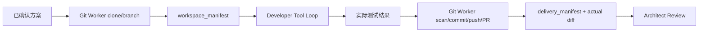

# ADR-0006：可信 Git Worker 与开发工具循环

- 状态：接受
- 日期：2026-08-05

## 背景

仅让开发 Agent 输出 `DevelopmentReport` 无法证明仓库真的被修改、测试真的执行或 PR/MR 真的存在。另一方面，把 Provider Token 和任意 Shell 直接交给模型会扩大供应链与提示注入风险。

## 决策

采用“两侧夹持”的执行模型：可信 Git Worker 负责工作区准备和发布，开发 Agent 只通过受限应用层工具修改工作区。

- clone URL 必须是不带凭据的 HTTPS 或 SSH，且主机必须匹配 Provider；SSH 用户固定为 `git`，`file://` 只在显式测试开关下允许。主机工作区与 SSH 挂载细节由 ADR-0011 补充。
- Agent 看不到 Git Token，不能访问 `.git`，不能运行 Git、Shell 或依赖安装命令。
- Git Worker 关闭 hooks，以临时进程环境注入认证 Header，不把凭据写进 remote URL 或仓库配置。
- 模型每轮只产生一个符合 Schema 的动作；服务端决定动作是否执行。
- 开发结束必须有实际成功测试；发布前扫描 Diff，发布后将真实 SHA、PR/MR 和 Diff 版本化。

## 后果

优点是职责、凭据和证据边界清晰，Review 不会在代码尚未发布时启动。代价是需要持久工作区 Volume，并要处理清理、容量、依赖缓存和跨仓组合测试。测试命令的断网执行边界已由 ADR-0008 补充；共享执行器不是多租户机密计算边界，此限制继续在威胁模型中记录。
