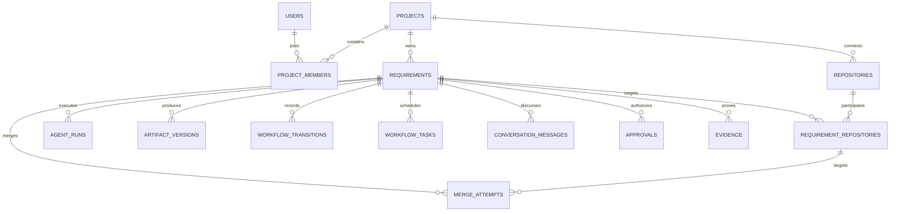

# 数据模型

## 数据原则

- 主键使用 UUID 字符串，时间以 UTC ISO-8601 保存。
- JSON 结构以文本保存并通过 Pydantic Schema 校验。
- 规格、方案、开发报告、评审和验收均创建不可变版本。
- 审批、状态转换、合并尝试和审计事件不可物理删除。
- `runtime_cursors` 持久化 Redis 结果消费位置；`webhook_deliveries` 以 Provider + delivery ID 去重。
- `schema_migrations` 记录已应用数据库版本；`requirement_repositories` 保存目标/工作分支、PR/MR URL、head SHA、合并顺序与状态；`agent_runs.agent_key` 将阶段角色稳定映射到四个 Agent 身份。
- `evidence` 保存大型不可变证据的需求/Agent 归属、类型、Artifact 相对路径、SHA-256 与字节数；对象本体按内容寻址保存，API 不返回内部路径。
- 常用查询只建立实际需要的索引；升级由有序事务迁移完成，运维窗口可执行 `PRAGMA optimize`。

## 保留

- 规格、方案、审批、Review、验收和合并记录长期保留。
- 脱敏详细日志热存储 180 天，之后压缩归档两年。
- Secret、Authorization、Cookie 和私钥不得进入持久日志。
