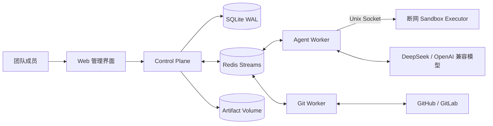

# 总体架构

## 组件职责

- Web：项目、仓库、需求、Agent 时间线、评审、验收和合并界面。
- Control Plane：唯一数据库访问者；认证、RBAC、业务 API、Webhook、状态机、调度与 SSE。
- Agent Worker：无数据库权限；从 Redis 获取不可变任务，调用模型和受控工具，回传结构化结果。
- Git Worker：可信边界内执行 clone、branch、push、PR/MR、CI 查询和 merge。
- Sandbox Executor：通过 Unix Socket 接收已经过 Agent Worker 校验的测试命令；容器使用 `network_mode: none`、非 root、只读根文件系统、无 Docker Socket、无平台数据库和 Git/模型凭据，并施加目录、命令、输出大小、超时和进程资源限制。它是共享执行服务，不是每需求临时创建一个容器。
- Redis：任务与事件传输；不是权威状态源。
- Artifact：结构化规格、方案、开发/评审/验收报告和 Git manifest 版本化存入 SQLite；超过内联阈值的完整 Diff 按 SHA-256 内容寻址写入 Artifact Volume，SQLite `evidence` 只保存路径、摘要、大小和归属，并通过项目 RBAC 下载。

## 恢复模型

Control Plane 使用事务 Outbox。业务变化与待发送事件同事务提交，Scheduler 将事件发布到 Redis。Worker 通过租约和心跳执行；租约过期后可重投。Redis 清空时从 SQLite 中未完成的 Outbox 和任务重建。

Agent 与 Git 使用不同 Redis Stream/Consumer Group。任务 ID 对应带 TTL 的 Redis 租约，Worker 异常退出后通过 `XAUTOCLAIM` 接管过期 Pending；结果 Stream 游标写入 SQLite，重复结果由任务终态幂等过滤。需求级分布式租约与全局有序集合共同限制同时运行的需求数，默认上限为 2；心跳维持长任务租约，进程消失后 TTL 自动释放容量。

## 部署约束

- MVP 为单机 Docker Compose。
- SQLite 位于 Docker 本地 Volume，不放置在 NFS。
- 当前单个 Agent Worker 和 Git Worker 各串行消费任务；可通过 Compose scale 增加 Worker，所有实例共享 Redis 需求租约和 `MAX_PARALLEL_REQUIREMENTS` 全局并发上限。
- 外部调用不得发生在数据库事务内。
