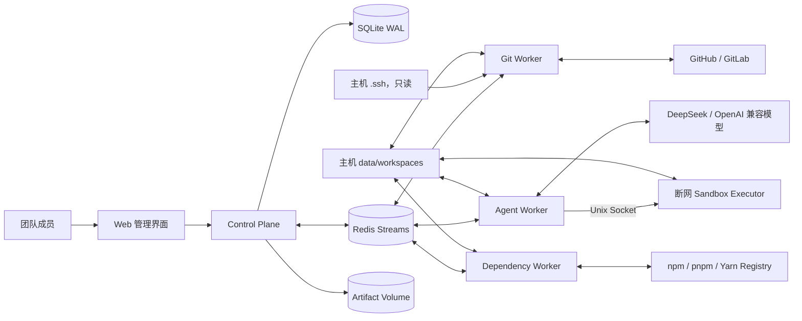

# 总体架构

## 组件职责

- Web：项目、仓库、需求、Agent 时间线、评审、验收和合并界面。
- Control Plane：唯一数据库访问者；认证、RBAC、业务 API、Webhook、状态机、调度与 SSE。
- Agent Worker：无数据库权限；从 Redis 获取不可变任务，调用模型和受控工具，回传结构化结果。
- Git Worker：唯一允许执行 Git 网络操作的可信 push/pull 容器；只读挂载主机 SSH 目录，执行 clone/fetch/branch/commit/push，并通过 Provider API 创建 PR/MR、查询 CI 和合并。
- Dependency Worker：在工作区准备完成后联网执行锁文件驱动的 Node 依赖安装。它不挂载 SSH、Provider Secret、模型 Key、数据库或 Docker Socket；默认禁用依赖生命周期脚本，并将下载缓存保存在独立 Volume。成功后开发任务才会投递给断网 Agent/Sandbox。
- Sandbox Executor：通过 Unix Socket 接收已经过 Agent Worker 校验的测试命令；容器使用 `network_mode: none`、非 root、只读根文件系统、无 Docker Socket、无平台数据库和 Git/模型凭据，并施加目录、命令、输出大小、超时和进程资源限制。它是共享执行服务，不是每需求临时创建一个容器。
- Provider Secret Store：独立 Docker Volume，不进入 SQLite、备份、Web 或 Agent。系统管理员通过 Control Plane 的 write-only 管理 API 原子替换 `0600` Token 文件；目录权限为 `0700`。Git Worker 以只读挂载在每次 Provider 任务开始时动态读取，因此页面配置无需重启服务。
- Redis：任务与事件传输；不是权威状态源。
- Artifact：结构化规格、方案、开发/评审/验收报告和 Git manifest 版本化存入 SQLite；超过内联阈值的完整 Diff 按 SHA-256 内容寻址写入 Artifact Volume，SQLite `evidence` 只保存路径、摘要、大小和归属，并通过项目 RBAC 下载。

## 恢复模型

Control Plane 使用事务 Outbox。业务变化与待发送事件同事务提交，Scheduler 将事件发布到 Redis。Worker 通过租约和心跳执行；租约过期后可重投。Redis 清空时从 SQLite 中未完成的 Outbox 和任务重建。

Agent、Git 与 Dependency Worker 使用独立 Redis Stream/Consumer Group。Worker 成功取得任务租约后，先向结果 Stream 回传 `running` 状态，并随 Redis 租约心跳续期，由 Control Plane 更新 `workflow_tasks` 和对应 `agent_runs`；终态结果继续通过同一 Stream 落库，因此 Worker 不需要数据库权限。任务 ID 对应带 TTL 的 Redis 租约，Worker 异常退出后通过 `XAUTOCLAIM` 接管过期 Pending；若运行态心跳过期，Control Plane 会把 SQLite 任务恢复为可重投的 `queued`。结果 Stream 游标写入 SQLite，重复结果由任务终态幂等过滤。需求级分布式租约与全局有序集合共同限制同时运行的需求数，默认上限为 2；心跳维持长任务租约，进程消失后 TTL 自动释放容量。

## 部署约束

- MVP 为单机 Docker Compose。
- SQLite 位于 Docker 本地 Volume，不放置在 NFS。
- 仓库代码位于 `${HOST_WORKSPACE_ROOT:-./data/workspaces}` 主机绑定目录，容器内统一映射为 `/workspaces`；`.ssh` 只挂载给 Git Worker，不挂载给 Agent Worker 或 Sandbox Executor。
- 当前 Agent、Git 和 Dependency Worker 各自串行消费独立 Redis Stream；可通过 Compose scale 增加 Worker，所有实例共享 Redis 需求租约和 `MAX_PARALLEL_REQUIREMENTS` 全局并发上限。
- 外部调用不得发生在数据库事务内。
