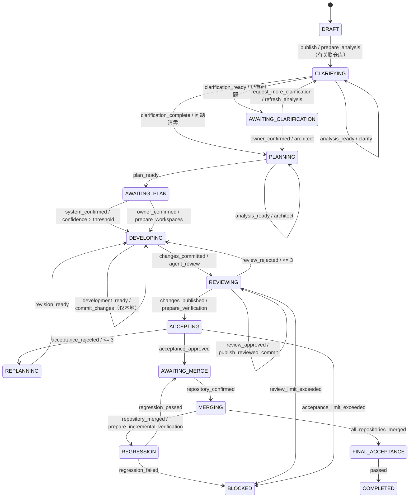

# 需求状态机

除远端合并正在执行的 `MERGING` 外，未完成需求可由需求创建者或项目 Owner 填写原因后关闭为 `CANCELLED`。关闭会把尚未完成的 `workflow_tasks` 与对应 `agent_runs` 标记为 `cancelled`，未发布 Outbox 不再投递，并向 Redis 写入需求终止标记，让各类 Worker 在获取执行租约前丢弃已经发布但尚未开始的消息；已经在途但迟到的 Worker 结果也不得写入产物或推进状态。历史、附件及已有 Git 交付物保留，已经提交或合并的代码不会自动回滚。远端合并具有不可逆副作用，因此必须等待本次合并返回后再关闭。暂停恢复时回到暂停前状态。所有转换由状态机服务校验并写入 `workflow_transitions`，API 不允许直接修改状态字段。

澄清阶段的 `clarification_spec.open_questions` 是交互门禁。开启仓库自动化且需求关联了仓库时，发布后先由可信 Git Worker 对目标分支执行只读分析并创建 fresh checkout；Agent1 在 Pi Core 会话中主动列目录、搜索和读取真实文件，先消化技术栈、目录、构建测试命令和现状，只能向用户追问仓库无法回答且会影响产品行为、范围或验收的决策。Web 直接展示问题清单；`request_more_clarification` 将需求提出者的回答写入 `conversation_messages`，并在下一轮 Agent1 前重新生成分析 checkout，避免旧目录已被后续清理或仓库基线已经变化。列表非空时进入 `AWAITING_CLARIFICATION` 等待回答；列表为空时通过 `clarification_complete` 自动进入方案阶段，架构师继续主动读取当前分析工作区。

方案阶段是代码变更前的开工授权门禁。`architecture_plan.confidence` 是系统架构师依据需求完整性、仓库证据覆盖、改动边界及验证/回滚可执行性给出的 0–100 校准值。平台始终先保存方案并写入 `plan_ready`；置信度严格大于 `ARCHITECTURE_AUTO_APPROVE_CONFIDENCE_THRESHOLD`（默认 90）时，再以 `system` 身份写入带阈值和置信度理由的 `confirm_plan`，自动开始开发。置信度小于等于阈值、缺失或无效时保留在 `AWAITING_PLAN`，由人工审核。该规则只替代方案开工授权，不改变后续 Code Review、验收和合并门禁。

Web 必须在操作按钮之前结构化展示需要人工审核的 `architecture_plan` 的置信度、目标架构、仓库改动、接口与数据库影响、测试策略、安全风险和回滚方案。`request_plan_change` 必须包含具体意见；意见写入 `conversation_messages`，并连同旧方案传给下一轮系统架构师。

开发与 Review 之间使用“先本地提交、后独立审查、批准后再推送”的证据链：

1. 开发工程师只能修改隔离工作区和运行测试，不能读取 `.git`、SSH Key 或网络凭据。
2. 工作区创建或失败恢复后，联网 Dependency Worker 根据仓库根目录的锁文件运行冻结安装；安装成功后才允许启动断网开发 Agent。无受支持锁文件的仓库显式标记为跳过。
3. 开发完成后，可信 Git Worker 将其工作树同步到干净 checkout，扫描 Secret，并在需求开发分支创建本地 commit；此时不 push。
4. `development_commit_manifest` 固化 `work_branch`、`baseline_sha`、`head_sha`、Diff 和 Diff SHA-256，并与开发报告一起传给系统架构师。
5. Review 驳回时，完整 `code_review_report`（包括每条 finding）进入下一轮开发上下文，开发工程师必须逐条处理并补充测试。
6. Review 批准后，Git Worker 只有在工作区仍干净、HEAD 与已审查 SHA 相同、Diff 摘要一致时才允许 push 和创建/更新 PR；因此推送内容不会偏离审查内容。

如果发布时仅有 SSH 凭据，Git Worker 先推送 reviewed 分支并保存 Compare 链接。之后配置 Provider Token 时，Owner 可在 `AWAITING_MERGE` 发起幂等的 `git.create_pull_request` 任务，无需重跑开发、Review 或验收；Git Worker 创建或复用 PR 后必须确认 Provider 返回的 head SHA 与既有 reviewed SHA 完全一致。Token 只存在于 Git Worker，Control Plane 只根据非敏感能力标志决定是否展示自动创建和自动合并动作。

验收阶段不是单次文本判断。可信 Git Worker 先准备并校验干净 checkout，平台复跑开发测试后，Agent4 根据确认规格中的 `acceptance_criteria[].verification_method`、架构测试策略和仓库内容建立逐项检查，通过只读工具循环获取文件检查与独立命令证据。`AcceptanceReport.criteria` 必须完整且不重复地覆盖确认规格；通过项必须引用与本项直接关联的平台证据 ID，必选项未通过、缺少 Agent4 独立成功命令、测试失败或工作区完整性异常时，Worker 与 Control Plane 均禁止批准。

## 计数与幂等规则

- Review 与验收业务拒绝分别最多三轮。
- 用户从阻塞态明确选择“从开发重试”时重置 Review 失败预算；选择“从方案重试”时同时重置 Review 与验收失败预算，形成新的实现周期。
- 开启仓库自动化后，阻塞态重试或旧数据迁移若缺少 `workspace_manifest`，必须先执行 `git.prepare_workspaces`，禁止直接启动开发 Agent。
- `workspace_ready`/`workspace_restored` 只调度 `dependency.prepare`；只有 `dependencies_ready` 才能调度 `agent.develop`。依赖失败在开发 Agent 启动前进入 `BLOCKED`。
- 自动化模式下开发 Agent 缺少真实工作区时以 `agent.workspace_missing` 失败，不允许退化为只生成文字报告的通用模型调用。
- 自动化模式下 Agent4 缺少对应阶段的干净验证工作区时以 `agent.verification_workspace_missing` 失败，不允许退化为只生成验收文本。
- 网络、限流、容器启动等技术错误只增加任务尝试次数。
- 可重试技术错误使用新任务 ID 和指数退避重新投递，避免与 Redis 完成锁冲突；默认最多三次，耗尽后进入 `BLOCKED`。
- 通用结构化输出在一次 JSON 修复后仍不符合角色 Schema 时，保留两次模型调用的 token 和字段级校验原因，并在原角色阶段按技术错误预算自动重试；Review 耗尽后可通过 `retry_review` 仅重跑代码评审，无需重新执行开发。
- 状态转换使用 `requirement_id + expected_version + event` 乐观并发控制。
- 外部任务使用稳定的 `idempotency_key`。
- Webhook 使用 Provider、外部仓库 ID 和投递 ID 去重。
- 开启仓库自动化且存在关联仓库时，需求澄清师和架构师都只能在可信 Git Worker 对目标分支完成只读 fresh clone 并生成 `repository_analysis` 后启动；两者都必须通过 Pi 只读工具检查真实文件，不能只依赖预生成摘要。
- Code Review 必须绑定明确的开发分支、commit SHA 与不可变 Diff 摘要；缺少任一项不得批准。
- 每个非最后仓库合并后，可信 Git Worker 都重新构造“已合并目标分支 + 未合并交付分支”的组合 checkout；Agent4 组合回归通过后才允许合并下一仓，失败进入 `BLOCKED`。
