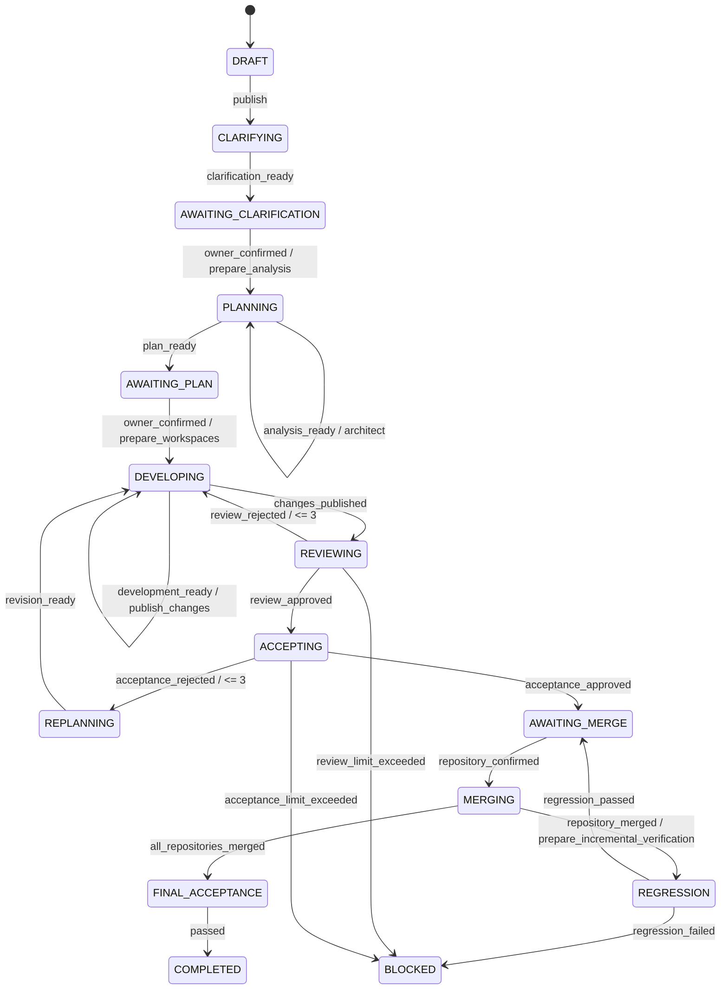

# 需求状态机

任意非终态可由有权限用户暂停或取消。恢复时回到暂停前状态。所有转换由状态机服务校验并写入 `workflow_transitions`，API 不允许直接修改状态字段。

## 计数与幂等规则

- Review 与验收业务拒绝分别最多三轮。
- 网络、限流、容器启动等技术错误只增加任务尝试次数。
- 可重试技术错误使用新任务 ID 和指数退避重新投递，避免与 Redis 完成锁冲突；默认最多三次，耗尽后进入 `BLOCKED`。
- 状态转换使用 `requirement_id + expected_version + event` 乐观并发控制。
- 外部任务使用稳定的 `idempotency_key`。
- Webhook 使用 Provider、外部仓库 ID 和投递 ID 去重。
- 开启仓库自动化时，架构师只能在可信 Git Worker 对目标分支完成只读 fresh clone 并生成 `repository_analysis` 后启动。
- 每个非最后仓库合并后，可信 Git Worker 都重新构造“已合并目标分支 + 未合并交付分支”的组合 checkout；Agent4 组合回归通过后才允许合并下一仓，失败进入 `BLOCKED`。
